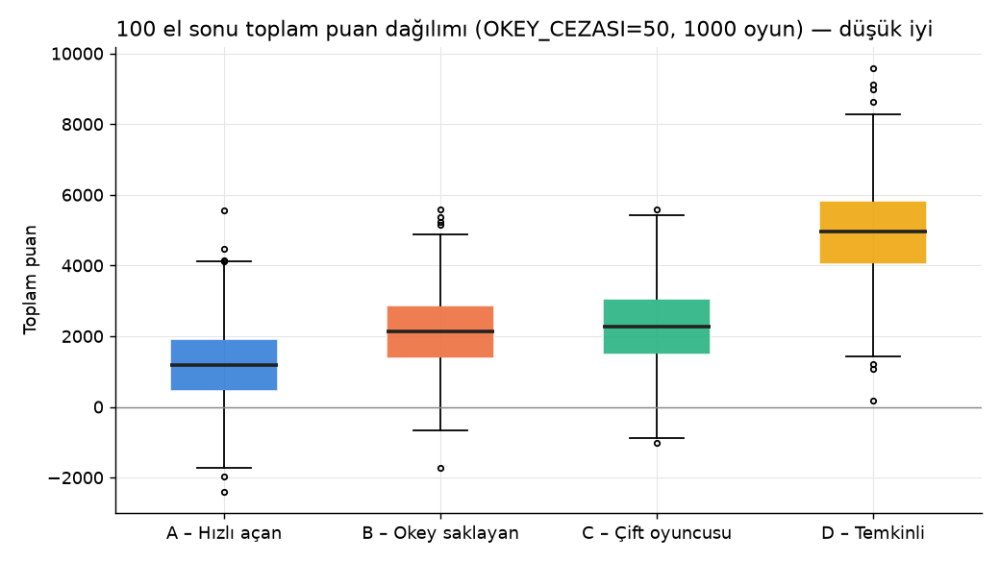
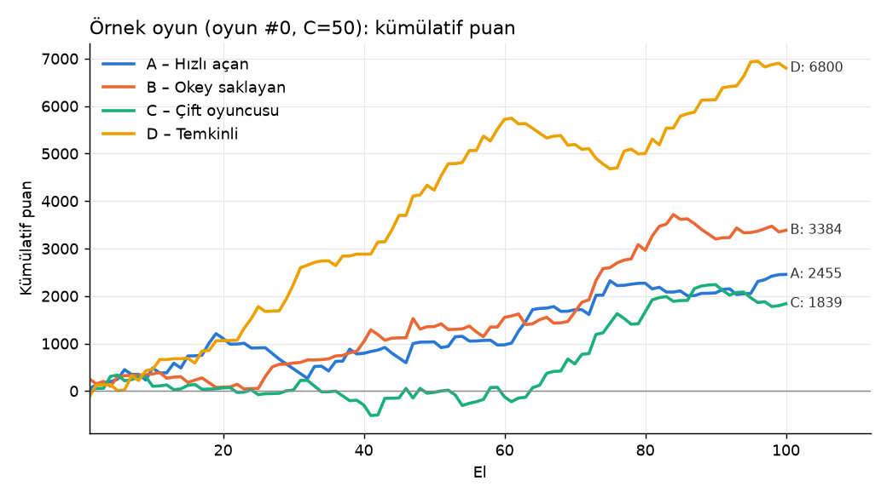
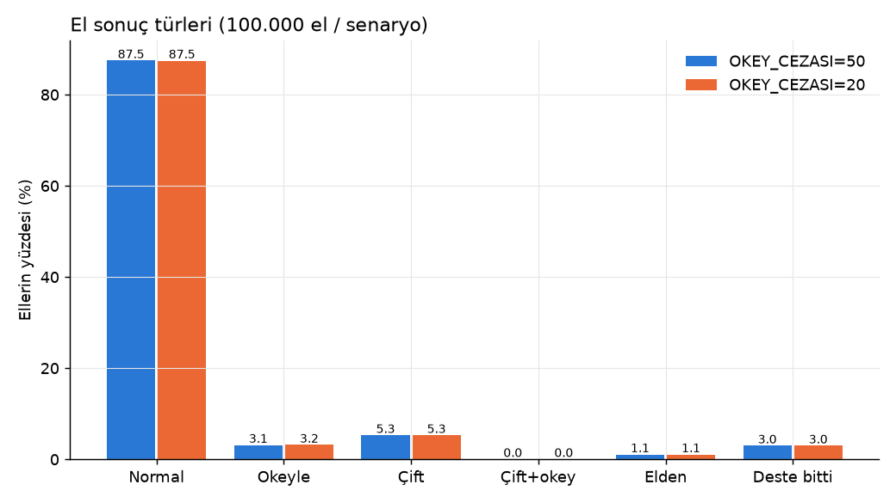

# 101 Okey (özel kurallı varyant) – Monte Carlo Simülasyon Raporu

**Kapsam:** 2 senaryo × 1.000 oyun × 100 el = 200.000 el. 4 bot (A/B/C/D), oturma sırası her oyunda rastgele, dağıtan her elde saat yönünde döner. Seed = 2026 (`python3 run_all.py 1000` aynı sonuçları üretir). Ana senaryo OKEY_CEZASI = 50, karşılaştırma OKEY_CEZASI = 20.

Kod: `okey101/` (`tiles.py` taşlar, `solver.py` memoize backtracking per/çift çözücü, `engine.py` el motoru + puanlama + assert'ler, `bots.py` stratejiler, `sim.py` paralel koşucu, `report.py` istatistik/grafik, `validate.py` doğrulama).

## Özet

- **Baskın strateji: A (hızlı açan).** C=50'de oyunların %58,8'ini kazanıyor, 100 el sonu ortalaması 1.192. Sırada B (2.130), C (2.296) ve açık ara sonuncu D (4.952; oyunların %86,7'sinde 4.) var.
- **Dengeyi en çok bozan kural: açamama cezası (+202).** Destede sadece 21 taş kalıyor ve el ortalama 12,4 turda bitiyor. Bu kadar kısa elde beklemek pahalı: D ellerin %35,5'inde açamıyor, A'da bu oran %18,6.
- **OKEY_CEZASI 50'den 20'ye inince sıralama değişmiyor** (A < B < C < D). Okeyle bitirme oranı neredeyse aynı kalıyor (%3,15 → %3,16), yalnızca aradaki farklar daralıyor.

## Grafikler







# 1–2. Oyuncu ve masa istatistikleri

"Açamama %": bitirmeyen oyuncunun o elde hiç açamadığı ellerin oranı (deste biten eller hariç). "Bonus puanı": ilk açıp bitirmekten gelen −20'lerin toplamı. "Okey cezası": elde kalan okeyler yüzünden yenen toplam puan (1000 oyun). `islenebilir_atma` = işlenebilir taş atma, `okey_atma` = bitirme dışında okey atma. Botların yerden alma kuralı yalnızca açabileceklerinde yerden almak olduğundan "yerden alıp açamama" cezası hiç oluşmadı (0).

## OKEY_CEZASI=50

| Oyuncu | Ort. | Medyan | Std | Min | Max | 1. % | 2. % | 3. % | 4. % | El başı ort. |
|---|---|---|---|---|---|---|---|---|---|---|
| A – Hızlı açan | 1192 | 1174 | 1077 | -2409 | 5548 | 58.8 | 27.0 | 12.6 | 1.6 | 11.9 |
| B – Okey saklayan | 2130 | 2142 | 1071 | -1732 | 5588 | 22.6 | 35.8 | 36.9 | 4.7 | 21.3 |
| C – Çift oyuncusu | 2296 | 2283 | 1183 | -1012 | 5593 | 18.0 | 34.8 | 40.2 | 7.0 | 23.0 |
| D – Temkinli | 4952 | 4962 | 1324 | 173 | 9592 | 0.6 | 2.4 | 10.3 | 86.7 | 49.5 |

| Oyuncu | Bitirme | Normal | Okeyle | Çift | Çift+okey | Elden | İlk açan (el) | Bonus alınan el | Bonus puanı | Açamama % | Okey cezası (toplam) | +101 cezaları (adet / puan) | Çift açtığı el |
|---|---|---|---|---|---|---|---|---|---|---|---|---|---|
| A | 26696 | 26016 | 354 | 0 | 0 | 326 | 29111 | 10538 | −210760 | 18.6 | 416300 | 204 (islenebilir_atma:204) / 20200 | 0 |
| B | 22303 | 20092 | 1887 | 0 | 0 | 324 | 29187 | 8743 | −174860 | 17.7 | 911150 | 840 (islenebilir_atma:140, okey_atma:700) / 75548 | 0 |
| C | 23947 | 18136 | 352 | 5276 | 36 | 147 | 24900 | 8792 | −175840 | 20.3 | 677400 | 178 (islenebilir_atma:178) / 17978 | 28965 |
| D | 24060 | 23227 | 552 | 0 | 0 | 281 | 16802 | 6997 | −139940 | 35.5 | 1347200 | 649 (islenebilir_atma:649) / 64842 | 0 |

| Sonuç türü | El | % | 100 elde |
|---|---|---|---|
| Normal | 87471 | 87.47 | 87.5 |
| Okeyle | 3145 | 3.15 | 3.1 |
| Çift | 5276 | 5.28 | 5.3 |
| Çift+okey | 36 | 0.04 | 0.0 |
| Elden | 1078 | 1.08 | 1.1 |
| Deste bitti | 2994 | 2.99 | 3.0 |

- Toplam el: **100000**
- Elde ortalama açamayan kişi sayısı (normal/okey/çift bitişli ellerde): **0.67**
- Ortalama el uzunluğu: **12.42 tur** (bir tur = bir oyuncunun hamlesi)
- Sahte okey özel işleme kuralı kullanımı: **17253** kez
- Okey değiştirme kullanımı: **182301** kez

## OKEY_CEZASI=20

| Oyuncu | Ort. | Medyan | Std | Min | Max | 1. % | 2. % | 3. % | 4. % | El başı ort. |
|---|---|---|---|---|---|---|---|---|---|---|
| A – Hızlı açan | 948 | 944 | 1028 | -2469 | 5007 | 53.9 | 28.0 | 16.3 | 1.8 | 9.5 |
| B – Okey saklayan | 1584 | 1602 | 1016 | -2194 | 4879 | 26.7 | 35.6 | 32.8 | 4.9 | 15.8 |
| C – Çift oyuncusu | 1893 | 1901 | 1121 | -1072 | 4926 | 18.5 | 33.1 | 40.1 | 8.3 | 18.9 |
| D – Temkinli | 4151 | 4146 | 1210 | 113 | 8242 | 0.9 | 3.3 | 10.8 | 85.0 | 41.5 |

| Oyuncu | Bitirme | Normal | Okeyle | Çift | Çift+okey | Elden | İlk açan (el) | Bonus alınan el | Bonus puanı | Açamama % | Okey cezası (toplam) | +101 cezaları (adet / puan) | Çift açtığı el |
|---|---|---|---|---|---|---|---|---|---|---|---|---|---|
| A | 26662 | 25985 | 351 | 0 | 0 | 326 | 29111 | 10514 | −210280 | 18.6 | 166580 | 202 (islenebilir_atma:202) / 19998 | 0 |
| B | 22399 | 20165 | 1910 | 0 | 0 | 324 | 29187 | 8763 | −175260 | 17.7 | 377380 | 830 (islenebilir_atma:134, okey_atma:696) / 74538 | 0 |
| C | 23928 | 18119 | 351 | 5275 | 36 | 147 | 24900 | 8775 | −175500 | 20.3 | 271000 | 176 (islenebilir_atma:176) / 17776 | 28968 |
| D | 24018 | 23186 | 551 | 0 | 0 | 281 | 16802 | 6986 | −139720 | 35.5 | 539120 | 649 (islenebilir_atma:649) / 64842 | 0 |

| Sonuç türü | El | % | 100 elde |
|---|---|---|---|
| Normal | 87455 | 87.45 | 87.5 |
| Okeyle | 3163 | 3.16 | 3.2 |
| Çift | 5275 | 5.28 | 5.3 |
| Çift+okey | 36 | 0.04 | 0.0 |
| Elden | 1078 | 1.08 | 1.1 |
| Deste bitti | 2993 | 2.99 | 3.0 |

- Toplam el: **100000**
- Elde ortalama açamayan kişi sayısı (normal/okey/çift bitişli ellerde): **0.67**
- Ortalama el uzunluğu: **12.42 tur** (bir tur = bir oyuncunun hamlesi)
- Sahte okey özel işleme kuralı kullanımı: **17261** kez
- Okey değiştirme kullanımı: **182155** kez


# 3. Karşılaştırma: OKEY_CEZASI = 20 ve 50

| Metrik | C=50 | C=20 |
|---|---|---|
| Okeyle bitirme (normal + çift) | %3,18 (3.181 el) | %3,20 (3.199 el) |
| B'nin okeyle bitirmesi | 1.887 | 1.910 |
| Sıralama (ortalama puana göre) | A 1.192 < B 2.130 < C 2.296 < D 4.952 | A 948 < B 1.584 < C 1.893 < D 4.151 |
| A'nın 1. olma oranı | %58,8 | %53,9 |
| D'nin 4. olma oranı | %86,7 | %85,0 |
| B − A farkı (oyun başına) | 938 | 636 |
| Toplam okey cezası (4 oyuncu) | 3,35 M | 1,35 M |

**Sıralama değişmedi.** Okey cezası düşünce B'nin okey saklama eşiği (p_kendi×101 > p_rakip×C) biraz daha sık sağlanıyor ve B 23 okeyle bitirme daha yapıyor. Fark küçük çünkü el çok kısa, okeyle bitirme fırsatı az. Asıl etki okey cezasının kendisinde: ceza 50 iken B oyun başına 911 puan yiyor, 20 iken 377. B ile A arasındaki fark bu yüzden kapanıyor.

# 5. Yorum

**1. En belirleyici kural: açamama cezası (+202) ve kısa deste.** Dağıtımdan sonra destede 106 − 85 = 21 taş kalıyor ve el ortalama 12,4 hamlede bitiyor. Botlar ellerin ~%97'sinde bitiriyor, ellerin yalnızca %3'ü desteyle bitiyor. Bu tempoda beklemek cezalandırılıyor. D, açmak için 121 bekliyor ve ellerin %35,5'inde açamadan 202 yiyor. A'da bu oran %18,6. Açamama farkı başlı başına D'ye oyun başına kabaca (0,355 − 0,186) × 202 × ~75 ≈ **+2.500** puan ekliyor. D'nin A'ya olan toplam açığı 3.760 puan; bunun üçte ikiye yakını bu kaynaklı. **Kırılma noktası:** 21 taşlık destede her açma eşiği artışı doğrudan açamama olarak geri dönüyor. D ancak deste ≤8 kaldığında 101'e iniyor, bu da çoğu zaman çok geç.

**2. İlk açan bonusu (−20) küçük bir etken.** A bonusu 10.538 elde almış; bu oyun başına ~211 puan. B için ~175, C için ~176, D için ~140. A ile D arasındaki fark oyun başına yalnızca ~71 puan. A'yı öne çıkaran bonus değil, erken açarak 202 cezasından kaçması.

**3. Okey saklamak (B) bu kurallarda zararlı.** B okeyle bitirmeyi A'nın 5 katı yapıyor (1.887'ye karşı 354). Bu oyun başına ~190 puanlık ek kazanç (1.887 × 101 / 1000). Ama elde kalan okey cezası oyun başına 911 puan (A: 416), yani **+495 fark**. Üstüne sakladığı okeyi başka taşı kalmayınca atmak zorunda kalıp 700 kez +101 yiyor: oyun başına ~71. Net etki kabaca −190 + 495 + 71 ≈ **+376 puan/oyun zarar**. B'nin A'ya olan 938 puanlık açığının yaklaşık %40'ı bu. Kuraldaki formül p_rakip'i hafife alıyor çünkü el kısa ve rakipler hızlı bitiriyor.

**4. Çift açma (C) yüksek risk, düşük getiri.** C 28.965 elde çift açıyor ama bunların yalnızca 5.312'sinde (%18) çift bitiriyor. Çift bitirmek −202, çift+okey −404 kazandırıyor. Bitiremeyince ise kalan taşlar ×2 ve okey cezası ×2 sayılıyor. 21 taşla tamamen çiftlere bölünmek zor. Çift açan oyuncu tek taşları seri/gruplara işleyebiliyor, ama yine de ortalamada C, B'yi ancak yakalıyor. Çift+okey (−404) yalnızca 36 kez oldu; neredeyse hiç görülmeyen bir kural.

**5. Elden bitme nadir ama sert.** Ellerin %1,08'i (oyun başına ~1,1 el) elden bitiyor ve diğer üç oyuncuya 404'er puan yazıyor. Bir oyunda tek bir elden bitme, oyuncular arasında ~600 puanlık fark açabiliyor. Standart sapmanın (~1.100) önemli bir kısmı buradan geliyor.

**6. Okey değiştirme ve sahte okey istisnası.** Okey değiştirme 182.301 kez kullanıldı (el başına ~1,8). En büyük sebep A'nın fazla okeylerini masadaki serilere işlemesi: bu okeyler hemen rakiplere geçiyor. Sahte okey istisnası 17.253 kez kullanıldı (el başına ~0,17). Bu kural, masada C'nin çift alanı olduğunda düz açmış oyuncuya sahte + en yüksek taşını tek hamlede bırakma imkânı veriyor; bitirmeyi hızlandıran küçük ama gerçek bir etki.

**Sonuç:** Bu kural setinde doğru strateji "mümkün olan ilk anda 101 ile aç, okeyi elde tutma". Dengeyi en çok etkileyen iki parametre destenin kısalığı ve +202 açamama cezası. Denge için ilk öneri, açamama cezasını düşürmek ya da deste boyutunu artırmak (ör. 22/21 yerine 14 taş dağıtmak). OKEY_CEZASI 20–50 aralığında sıralamayı değiştirmiyor, yalnızca B'nin açığını büyütüp küçültüyor.

# Varsayımlar ve basitleştirmeler

1. **Deste:** 106 − (22 + 3×21) = 21 taş kalıyor. Sıradaki oyuncu çekmek istediğinde deste boşsa el "deste bitti" olarak sona eriyor.
2. **Yerden alma:** Yalnızca bir önceki oyuncunun son attığı taş alınabiliyor. Alınan taşın açmada kullanılması zorunlu tutulmadı, sadece o turda açılması (ya da bitirilmesi) şartı aranıyor.
3. **Açma:** Açma tek hamlede ve tek türde yapılıyor. Açılan turda masadaki perlere işleme yapılmıyor, yalnızca kendi perler koyuluyor. Açma + bitirme aynı hamlede yapılabiliyor; masada kimse açmamışsa bu "elden" sayılıyor.
4. **Açtıktan sonra:** Düz açan yeni seri/grup koyabiliyor (değer alt sınırı yok) ve her seri/gruba işleyebiliyor. Çift açan yeni çift koyabiliyor ve seri/gruplara tek taş işleyebiliyor, ama yeni seri/grup açamıyor.
5. **Okey:** Seri/gruptaki okey belirli bir taşı temsil ediyor. Gruplarda okey, eksik renklerden sırayla ilkini temsil ediyor. Okey değiştirme o gerçek taşla yapılıyor. Serilere okey de işlenebiliyor.
6. **Okey olarak 1'ler:** Aynı renkten iki 1 de iki okey sayılıyor. Okey + okey çift sayılıyor, sahte + okey ve sahte + sahte sayılmıyor.
7. **Sahte okey istisnası:** Düz açmış oyuncu, masada başka bir oyuncunun çift alanı varsa, (sahte + elindeki en yüksek gerçek taş) çiftini oraya işleyebiliyor.
8. **İşlenebilir taş cezası:** Masadaki bir seri/gruba eklenebilecek gerçek taşı atan herkese (açmamış olsa da) uygulanıyor. Botlar bundan kaçınıyor, ama elde başka taş kalmayınca ceza oluşabiliyor. Bitirme hamlesinde uygulanmıyor. Çift alanına "işlenebilirlik" dikkate alınmıyor.
9. **Puan toplamı:** Elde kalan okey sayı toplamına 0 olarak giriyor (yalnızca okey cezası ekleniyor). Sahte 0 sayılıyor.
10. **+101 cezaları:** Normal bitişli ellerde eli bitiren dahil herkesin puanına ekleniyor. Kuraldaki "SADECE" / "başka ceza eklenmez" ifadeleri harfiyen uygulandı: deste bittiğinde ve elden bitmede +101 cezaları puana yansımıyor (sayaçlarda görünmeye devam ediyor).
11. **Sıralama beraberliği:** Eşit puanda oyuncular aynı (daha iyi) sırayı paylaşıyor.
12. **Botlar:** Hepsi seri/grup çözücüsünü "önce en çok taş, sonra en yüksek değer" ya da "en yüksek açma değeri" moduyla kullanıyor. Atılacak taş, pere girmeyen taşlar arasından bağlantı skoruna göre seçiliyor (aynı renk ±1/±2, aynı sayı farklı renk). Açmamışken yüksek taşlar, açtıktan sonra düşük taşlar tutuluyor. Botların elde tutma, yerden alma ve atma kararları da bu skora dayanıyor.
   - **A:** 101'de açar, fazla okeyini masaya işler.
   - **B:** 101'de açar. Pere girmeyen taş ≤3 iken p_kendi = 1/(1+kalan), p_rakip = max(açmış rakip için 1/(el−1), açmamış rakip için 0,02) tahmin eder; p_kendi×101 > p_rakip×C ise bir okeyi saklar.
   - **C:** El başında (gerçek çift + okey + sahte) ≥ 5 ise çift oynar, ≥6 çiftle (deste ≤10 iken ≥5 çiftle) açar. Değilse A gibi düz oynar.
   - **D:** 121 bekler, deste ≤8 kalınca 101'e iner. Fazla okeyini yalnızca bitirmeye 1 taş kala işler.
13. **Bitirmeye yakınlık:** Pere girmeyen taş sayısı. Bitirme denemesinde her aday son taş (önce okey) için elin geri kalanının tamamen masaya konup konamayacağı çözücüyle kontrol ediliyor.
14. **Tur sınırı:** Sonsuz döngüye karşı 300 hamle sınırı var (hiç tetiklenmedi).

# Doğrulama

`okey101/validate.py`, `check=True` ile 10 el oynatıyor. Her hamleden sonra 106 taşın korunumu, masadaki her seri/grubun geçerliliği (uzunluk ≥3, grup ≤4, seri 2–13) ve her çiftin geçerliliği kontrol ediliyor. El sonunda şunlar assert ediliyor:
- Bitirenin eli boş.
- Bitirme türü açma türüyle uyumlu (düz → normal/okeyle, çift → çift/çift+okey).
- Okeyle bitirmede son atılan taş okey.
- Bonus yalnızca ilk açana veriliyor ve elden bitmede verilmiyor.
- Elden bitmede diğerleri tam 404 alıyor.
- Deste bitince puanlar yalnızca okey × C.
- Açamayan oyuncunun puanı ≥202.
- Bitirenin puanı = taban + bonus + ceza.

Bu assert'ler (korunum hariç) 200.000 elin hepsinde de çalıştı. 10 elin hepsi geçti.

Doğrulama elleri ve örnek el logu:


normal, normal, normal, normal, normal, normal, normal, cift, normal, normal

```
Dağıtan: A, başlayan (22 taş): B
  A [duz] eli: K2 K4 K5 K7 K8 K9 K10 K12 K13 K13 S4 S6 S7 S10 M2 M5 M6 Y1* Y3 Y8 Y12
  B [duz] eli: K3 K6 S1* S3 S5 S6 S7 S8 S9 S11 M2 M3 M3 M4 M12 M12 Y1* Y5 Y6 Y11 Y12 Y13
  C [duz] eli: K4 K10 K11 K12 S1* S5 S8 S12 M4 M6 M9 M10 M11 Y2 Y2 Y3 Y4 Y5 Y6 Y7 Y8
  D [duz] eli: K1* K3 K5 K7 K9 K11 S2 S4 S9 S11 S13 M5 M7 M8 M9 Y9 Y10 Y10 Y11 Y13 SO
T1 B: (22 taş, çekmeden başlar)
  B DÜZ AÇTI (111): M2 M3 M4 | K3 S3 M3 | S5 Y5 S1* | K6 S6 Y6 | S7 S8 S9 | Y11 Y12 Y13
  B M12 attı | el(3): S11 M12 Y1*
T2 C: yerden M12 aldı
  C DÜZ AÇTI (125): Y2 Y3 Y4 | M4 S1* M6 | Y5 Y6 Y7 Y8 | M9 M10 M11 M12 | K10 K11 K12
  C S12 attı | el(4): K4 S5 S8 Y2
T3 D: yerden S12 aldı
  D DÜZ AÇTI (133): M7 M8 M9 | K9 S9 Y9 | Y10 Y11 K1* Y13 | S11 S12 S13
  D K11 attı | el(8): K3 K5 K7 S2 S4 M5 Y10 SO
T4 A: desteden S13 çekti
  A M2 attı | el(21): K2 K4 K5 K7 K8 K9 K10 K12 K13 K13 S4 S6 S7 S10 S13 M5 M6 Y1* Y3 Y8 Y12
T5 B: desteden K2 çekti
  B M12 attı | el(3): K2 S11 Y1*
T6 C: desteden Y9 çekti
  C masaya 1 taş koydu/işledi
  C S8 attı | el(3): K4 S5 Y2
T7 D: desteden M8 çekti
  D masaya 6 taş koydu/işledi (okey değiştirme x2)
  D K7 attı | el(2): K3 SO
T8 A: desteden SO çekti
  A K2 attı | el(21): K4 K5 K7 K8 K9 K10 K12 K13 K13 S4 S6 S7 S10 S13 M5 M6 Y1* Y3 Y8 Y12 SO
T9 B: desteden M1* çekti
  B son taşı K2 atıp BİTİRDİ -> normal
SONUÇ: normal; puanlar: A=252, B=-121, C=11, D=3
```
