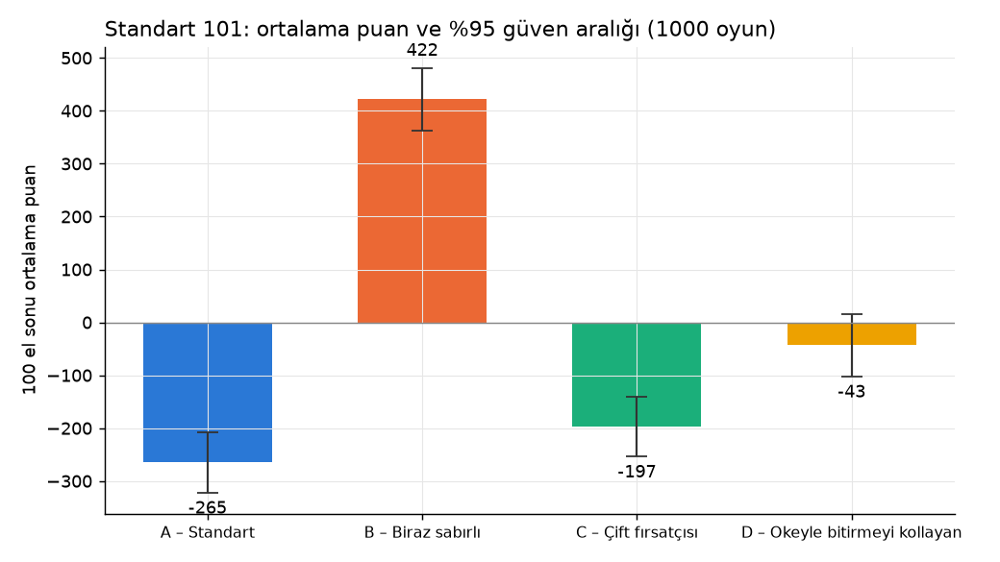
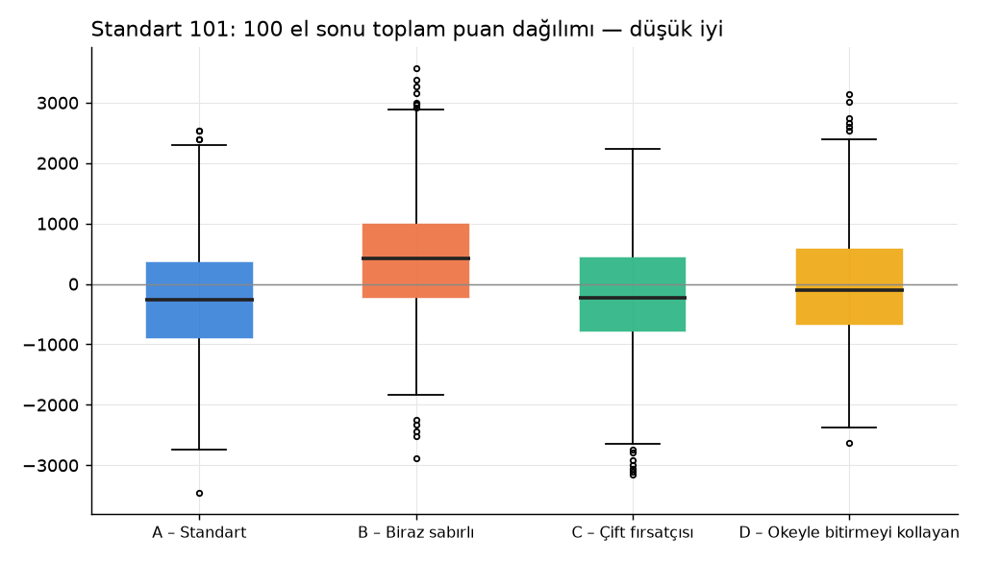
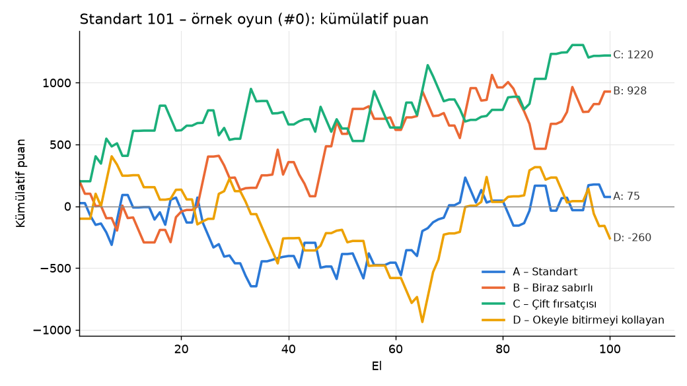
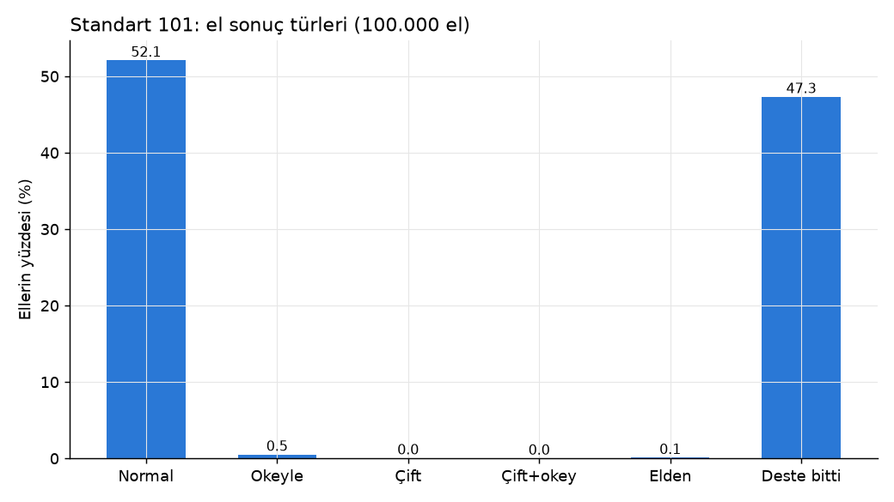

# Standart 101 Okey – Monte Carlo Simülasyonu

**Kapsam:** 1.000 oyun × 100 el = 100.000 el. Dört bot aynı greedy çekirdekle oynuyor ve her biri tek bir nüansla ayrışıyor. Oturma sırası her oyunda rastgele, dağıtan her elde saat yönünde dönüyor. Seed = 2026; `python3 run_std.py 1000` aynı sonuçları üretir (~10 dk). Standart motor: `okey101/std_engine.py`, botlar: `okey101/std_bots.py`.

## Uygulanan standart kurallar

- **Taşlar:** 106 taş, gösterge açılır. Okey, göstergenin aynı renkte bir üstüdür (13'ün üstü 1). 2 okey taşı her perde jokerdir.
- **Sahte okey:** Okey taşının kendisi yerine geçer; joker değil, normal bir taştır.
- **1'in kullanımı:** 1 hem 1-2-3'te hem 12-13-1'de kullanılabilir; 13-1-2 yok.
- **Dağıtım:** 22 / 21 / 21 / 21. Destede 20 taş kalır.
- **Açma:** Seri + grup toplamı ≥101 ya da en az 5 çift. Açan her pere işleyebilir ve okey değiştirebilir.
- **Cezalar (+101):** Yerden alıp o tur açamamak, işlenebilir taş atmak, bitirme dışında okey atmak.
- **Gösterge:** Göstergenin eşini ilk turunda gösteren −101 alır.
- **Bitirme:**
  - Normal: −101
  - Okeyle: −202, diğerlerinin cezası ×2
  - Çift açıp bitirme: −202, ×2
  - Çift açıp okeyle bitirme: −404, ×4
  - Elden bitme: −202, ×2
- **Bitiremeyenler:**
  - Açamayan: 202
  - Düz açan: kalan taşların toplamı + elde kalan okey başına 101
  - Çift açan: bunun ×2'si
  - Katsayı (×2/×4) bunların üstüne uygulanır.
- **Deste biterse:** El puansız kapanır; yalnızca +101 cezaları ve gösterge puanı yazılır.
- **İlk açan bonusu yok.**

## Dört benzer karakter

Dördü de aynı motoru kullanıyor: aynı per çözücü, aynı atılacak taş sezgisi, aynı yerden alma kuralı (yalnızca o tur açabilecekse). Tek fark:

| Bot | Tek nüans |
|---|---|
| **A – Standart** | 101'e ulaştığı ilk anda açar (referans oyuncu). |
| **B – Biraz sabırlı** | 111 bekler, deste ≤8 kalınca 101'e iner. |
| **C – Çift fırsatçısı** | Başlangıç elinde (çift + okey) ≥6 ise çifte oynar (ellerin ~%1'i); diğer ellerde A ile aynı. |
| **D – Okeyle bitirmeyi kollayan** | Bitirmeye ≤2 taş kala bir okeyi son taş olarak saklar; fazla okeyi masaya işlemez. |

## Özet

- **Standart 101 büyük ölçüde şans oyunu.** Oyun sonu puanının standart sapması ~930, en iyi ve en kötü nüans arasındaki fark ~690 puan. Referans bot A bile oyunların yalnızca %34,4'ünü kazanıyor (şansa göre beklenen %25) ve %16,2'sinde sonuncu oluyor.
- **En iyi davranış: 101'e ulaşınca hemen açmak.** A (−265 ± 57) ve C (−197 ± 57) istatistiksel olarak başa baş. C çifte çok nadir oynadığı için neredeyse A ile aynı bot.
- **Açmak için 10 puan fazladan beklemek en pahalı nüans.** B, A'dan oyun başına **~690 puan** kötü (+422) ve oyunların %41,9'unda sonuncu.
- **Okeyi son taşa saklamak da zarar.** D okeyle bitirmeyi A'nın ~6,5 katı yapıyor (348'e karşı 53) ama yine de oyun başına **~220 puan** geride.
- **Ellerin %47'si desteyle bitiyor.** 20 taşlık destede ve yalnızca 2 jokerle botlar ellerin ancak yarısında bitirebiliyor. Ortalama el 20,8 hamle.

## Grafikler









## Sonuç tabloları

"Gösterge" sütunu göstergeyi ilk turda gösterip −101 aldığı el sayısı ve toplam puan. "Okey cezası" elde kalan okeylerin 101'lik cezası (katsayı dahil). "Katlama ek cezası" okeyle, çiftle ya da elden bitirmenin ×2/×4 katsayısından gelen ek puan.

| Oyuncu | Ort. (±%95 GA) | Medyan | Std | Min | Max | 1. % | 2. % | 3. % | 4. % | El başı |
|---|---|---|---|---|---|---|---|---|---|---|
| A – Standart | -265 ± 57 | -268 | 912 | -3449 | 2535 | 34.4 | 26.4 | 23.0 | 16.2 | -2.65 |
| B – Biraz sabırlı | 422 ± 59 | 427 | 953 | -2891 | 3576 | 12.8 | 18.6 | 26.7 | 41.9 | 4.22 |
| C – Çift fırsatçısı | -197 ± 57 | -224 | 915 | -3154 | 2234 | 28.5 | 27.4 | 25.8 | 18.3 | -1.97 |
| D – Okeyle bitirmeyi kollayan | -43 ± 59 | -108 | 952 | -2622 | 3144 | 24.3 | 27.7 | 24.5 | 23.5 | -0.43 |

| Oyuncu | Bitirme | Normal | Okeyle | Çift | Çift+okey | Elden | İlk açan | Gösterge (adet / puan) | Açamama %* | Okey cezası (elde kalan okey, çarpanlı) | Katlama ek cezası | +101 cezaları (adet) | Çift açtığı el |
|---|---|---|---|---|---|---|---|---|---|---|---|---|---|
| A | 13802 | 13732 | 53 | 0 | 0 | 17 | 26691 | 21042 / −2125242 | 34.2 | 34643 | 46716 | 221 (islenebilir_atma:221) | 0 |
| B | 12837 | 12768 | 40 | 0 | 0 | 29 | 19004 | 20896 / −2110496 | 40.4 | 28280 | 50137 | 385 (islenebilir_atma:385) | 0 |
| C | 13566 | 13447 | 59 | 42 | 0 | 18 | 27316 | 20877 / −2108577 | 34.5 | 32421 | 43682 | 240 (islenebilir_atma:239, yerden_acamadi:1) | 845 |
| D | 12497 | 12123 | 348 | 0 | 0 | 26 | 26642 | 21034 / −2124434 | 34.3 | 69589 | 25607 | 245 (islenebilir_atma:225, okey_atma:20) | 0 |

\* Açamama %: biri bitirdiği ve oyuncunun bitirmediği ellerde açamama oranı.

| Sonuç türü | El | % |
|---|---|---|
| Normal | 52070 | 52.07 |
| Okeyle | 500 | 0.50 |
| Çift | 42 | 0.04 |
| Çift+okey | 0 | 0.00 |
| Elden | 90 | 0.09 |
| Deste bitti | 47298 | 47.30 |

- Elde ortalama açamayan kişi (biri bitirdiğinde): **1.07**
- Elde ortalama açan kişi (tüm eller): **2.66**
- Deste biten ellerin **%0.7**'inde kimse açamamış
- Ortalama el uzunluğu: **20.78 hamle**
- Okey değiştirme: **55432** kez


## Yorum: olasılıklar ve nüansların etkisi

**1. Bir oyunu kazanma olasılığı çoğunlukla şansa bağlı.** Aynı motoru kullanan dört bot arasındaki en büyük ortalama fark (A ile B arası) ~690 puan. Tek bir oyunun standart sapması ise ~930. Pratikte "doğru" oynayan bir oyuncunun 4 kişilik masada kazanma şansı ~%34 (şansa göre %25). Bu avantaj ancak onlarca oyunda belirginleşiyor.

**2. Gösterge en büyük tekil puan kaynağı, ama herkese eşit dağılıyor.** Göstergenin eşi olan tek taş ellerin ~%84'ünde birinin eline geliyor. Her oyuncu oyun başına ~21 kez −101 alıyor: oyun başına ~−2.120 puan, yani tüm puanların en büyük parçası. Dört botta da aynı olduğu için sıralamayı etkilemiyor, ama bu puanlar ortalamaları sıfırın altına çekiyor.

**3. Açma eşiği en hassas parametre.** B yalnızca 10 puan fazla bekliyor. Bu yüzden:
- Biri bitirdiğinde açamamış olma oranı %34,2'den %40,4'e çıkıyor.
- 965 bitirme kaybediyor (12.837'ye karşı 13.802).
- İşlenebilir taş atma cezası artıyor (385'e karşı 221), çünkü açmadan beklerken masaya işlenebilen taşları atmak zorunda kalıyor.

Sonuç: oyun başına ~+690 puan. 101'de "biraz daha güçlü el beklemek" açıkça kaybettiriyor.

**4. Okeyle bitirmeyi kollamak kârlı değil.** D okeyle bitirince hem kendisi −202 alıyor hem rakiplerin cezası ikiye katlanıyor. Buna rağmen:
- Okeyi saklarken bitirmesi gecikiyor: 12.497 bitirme, A'dan 1.305 eksik. Bu oyun başına ~130 puan kaybı.
- Rakip bitirdiğinde elinde okey kalma cezası iki katına çıkıyor: 69.589'a karşı 34.643, oyun başına +35.
- Okeyle bitirme ve katlama avantajı ancak bunun bir kısmını geri kazandırıyor.

Net: oyun başına ~220 puan zarar.

**5. Çift, standart kurallarda nadir ve zor.** Tek joker kaynağı 2 okey ve sahteler normal taş sayılıyor. Bu yüzden 5+ çiftle açmak bile zor. C 845 elde çift açtı ama yalnızca 42'sinde bitirdi (%5). Toplam etkisi küçük çünkü C bu ellerin dışında A ile aynı oynuyor. Çift oynamak ancak çok güçlü çift ellerinde mantıklı; burada onda bile getirisi belirsiz.

**6. El sonuçları (100.000 el):**
- %52,1 normal bitiş
- %0,5 okeyle bitiş (bunun ~%70'i D'den)
- %0,04 çift bitiş
- %0,09 elden bitiş
- %47,3 deste bitti

Botlar ellerin yarısında bitiremiyor. Bu, gerçek oyuncuların muhtemelen daha çok yerden taş alıp daha agresif oynadığı durumlara göre yüksek olabilir (bkz. Varsayımlar). Ancak aynı sınırlama dört botta da ortak, sıralamayı etkilemez.

**7. Özel varyantla karşılaştırma:**
- Özel varyantta 8 sabit okey + 2 joker-sahte vardı; eller ortalama 12,4 hamlede bitiyor, deste yalnızca %3 tükeniyordu.
- Standartta 2 okey var; eller 20,8 hamle sürüyor ve yarısı desteyle bitiyor.
- İki kural setinde de aynı ders geçerli: **erken aç, okeyi saklama.** Varyantta bu dersler çok daha keskin (temkinli D oyunların %87'sinde sonuncuydu); standartta farklar gerçek ama şansın gölgesinde.

## Varsayımlar

1. Gösterge sahte okey çıkarsa destenin altına konup yeni gösterge açılıyor. Göstergenin eşini taşıyan oyuncu, ilk turunda (yerden alma/çekmeden sonra) bot olarak her zaman gösteriyor.
2. 12-13-1 serisindeki 1 değer olarak 1 sayılıyor (evlere göre 14 ya da 11 sayılabiliyor). 13-1-2 geçersiz.
3. Deste bittiğinde el puansız kapanıyor; yalnızca +101 cezaları ve gösterge yazılıyor. Bazı evlerde açamayanlar yine 202 yazar; bu kural deste bitişlerini çok daha pahalı yapardı.
4. Elden bitme −202 ve diğerleri ×2 (açamayanlar 404). Çift + okeyle bitirme ×4.
5. Elde kalan her okey 101 sayılıyor. Açamayan oyuncuya okey için ek ceza yok (sabit 202).
6. Yalnızca bir önceki oyuncunun son attığı taş alınabiliyor. Alınan taşın açmada kullanılması zorunlu tutulmadı, sadece o tur açılması şartı var. Botlar yerden yalnızca açabilecekleri (ya da açtıktan sonra işe yarayacak) durumda alıyor.
7. Açılan turda masadaki perlere işleme yapılmıyor. Açma + bitirme aynı hamlede olabilir (masada kimse açmamışsa elden). Çift açan yeni seri/grup açamıyor, ama perlere tek taş işleyebiliyor.
8. Botların greedy çekirdeği, taş atma sezgisi ve per çözücü özel varyant simülasyonuyla birebir aynı. Motor iki kural setini de aynı kodla, kural kancaları üzerinden oynatıyor. Refaktörün ardından varyant oyunları aynı seed ile bit bit aynı çıktı.

## Doğrulama

Her elde:
- Bitirme türü ile açma türünün uyumu
- Okeyle bitirmede son taşın okey olması
- Çift geçerliliği (okey her taşla, diğer taşlar yalnız eşiyle)
- Bitirenin puanı = taban + ceza + gösterge
- Açamayanların puanı = 202 × katsayı + ceza + gösterge
- Elden bitmede 404; deste bitince yalnız ceza + gösterge

Bu assert'ler 100.000 elin hepsinde çalıştı. 10 ellik doğrulama koşusunda ayrıca her hamleden sonra 106 taşın (gösterge dahil) korunumu ve masadaki perlerin geçerliliği (seri ≤13, 1 yalnız başta ya da 13'ten sonra) kontrol edildi.

Örnek el logu (`*` = okey, `SO` = sahte okey):
```
Dağıtan: B, başlayan (22 taş): C
Gösterge: Y3 -> okey: Y4 (elde * ile işaretli; SO = sahte okey = Y4)
  A [duz] eli: K1 K2 K3 K13 S2 S4 S9 S11 S11 S13 M1 M2 M5 M9 M13 Y8 Y11 Y11 Y12 Y12 SO
  B [duz] eli: K2 K5 K6 K7 K10 K10 K12 S4 S5 S6 S10 M1 M6 M8 M12 M13 Y4* Y6 Y9 Y10 Y13
  C [duz] eli: K1 K4 K8 K11 K13 S3 S3 S7 S8 S12 M5 M6 M7 M8 M10 Y1 Y2 Y2 Y5 Y8 Y9 Y13
  D [duz] eli: K4 K5 K6 K7 K8 S1 S1 S2 S6 S7 S13 M2 M3 M7 M10 M11 Y1 Y3 Y4* Y7 Y10
T1 C: (22 taş, çekmeden başlar)
  C S3 attı | el(21): K1 K4 K8 K11 K13 S3 S7 S8 S12 M5 M6 M7 M8 M10 Y1 Y2 Y2 Y5 Y8 Y9 Y13
T2 D: desteden M4 çekti
  D göstergeyi (Y3) gösterdi: −101
  D Y10 attı | el(21): K4 K5 K6 K7 K8 S1 S1 S2 S6 S7 S13 M2 M3 M4 M7 M10 M11 Y1 Y3 Y4* Y7
T3 A: desteden K12 çekti
  A M5 attı | el(21): K1 K2 K3 K12 K13 S2 S4 S9 S11 S11 S13 M1 M2 M9 M13 Y8 Y11 Y11 Y12 Y12 SO
T4 B: yerden M5 aldı
  B DÜZ AÇTI (128): M12 M13 M1 | K5 S5 M5 | K6 S6 M6 Y6 | K10 S10 Y10 | K10 Y4 K12
  B Y13 attı | el(5): K2 K7 S4 M8 Y9
T5 C: desteden S10 çekti
  C S3 attı | el(21): K1 K4 K8 K11 K13 S7 S8 S10 S12 M5 M6 M7 M8 M10 Y1 Y2 Y2 Y5 Y8 Y9 Y13
T6 D: desteden K9 çekti
  D DÜZ AÇTI (102): M2 M3 M4 | K4 K5 K6 | K7 K8 K9 | S7 M7 Y7 | M10 M11 Y4
  D S6 attı | el(6): S1 S1 S2 S13 Y1 Y3
T7 A: desteden S12 çekti
  A Y8 attı | el(21): K1 K2 K3 K12 K13 S2 S4 S9 S11 S11 S12 S13 M1 M2 M9 M13 Y11 Y11 Y12 Y12 SO
T8 B: desteden M3 çekti
  B masaya 1 taş koydu/işledi
  B Y9 attı | el(4): K2 S4 M3 M8
T9 C: desteden K3 çekti
  C K11 attı | el(21): K1 K3 K4 K8 K13 S7 S8 S10 S12 M5 M6 M7 M8 M10 Y1 Y2 Y2 Y5 Y8 Y9 Y13
T10 D: desteden K9 çekti
  D masaya 1 taş koydu/işledi
  D Y3 attı | el(5): S1 S1 S2 S13 Y1
T11 A: desteden Y5 çekti
  A S4 attı | el(21): K1 K2 K3 K12 K13 S2 S9 S11 S11 S12 S13 M1 M2 M9 M13 Y5 Y11 Y11 Y12 Y12 SO
T12 B: desteden S5 çekti
  B M8 attı | el(4): K2 S4 S5 M3
T13 C: desteden S9 çekti
  C S12 attı | el(21): K1 K3 K4 K8 K13 S7 S8 S9 S10 M5 M6 M7 M8 M10 Y1 Y2 Y2 Y5 Y8 Y9 Y13
T14 D: yerden S12 aldı
  D masaya 3 taş koydu/işledi
  D S2 attı | el(2): S1 Y1
T15 A: desteden M4 çekti
  A M4 attı | el(21): K1 K2 K3 K12 K13 S2 S9 S11 S11 S12 S13 M1 M2 M9 M13 Y5 Y11 Y11 Y12 Y12 SO
T16 B: desteden S8 çekti
  B S8 attı | el(4): K2 S4 S5 M3
T17 C: desteden M11 çekti
  C Y2 attı | el(21): K1 K3 K4 K8 K13 S7 S8 S9 S10 M5 M6 M7 M8 M10 M11 Y1 Y2 Y5 Y8 Y9 Y13
T18 D: desteden K11 çekti
  D K11 attı | el(2): S1 Y1
T19 A: yerden K11 aldı
  A DÜZ AÇTI (114): K2 S2 M2 | K11 S11 Y11 | K12 S12 Y12 | K13 S13 M13
  A Y12 attı | el(9): K1 K3 S9 S11 M1 M9 Y5 Y11 SO
T20 B: desteden M12 çekti
  B masaya 3 taş koydu/işledi (okey değiştirme x1)
  B M3 attı | el(1): K2
T21 C: desteden Y6 çekti
  C K4 attı | el(21): K1 K3 K8 K13 S7 S8 S9 S10 M5 M6 M7 M8 M10 M11 Y1 Y2 Y5 Y6 Y8 Y9 Y13
T22 D: desteden Y7 çekti
  D Y7 attı | el(2): S1 Y1
T23 A: desteden M9 çekti
  A masaya 5 taş koydu/işledi
  A Y11 attı | el(4): K1 S9 M9 SO
T24 B: desteden SO çekti
  B son taşı SO atıp BİTİRDİ -> normal
SONUÇ: normal; puanlar: A=23, B=-101, C=202, D=-99
```
